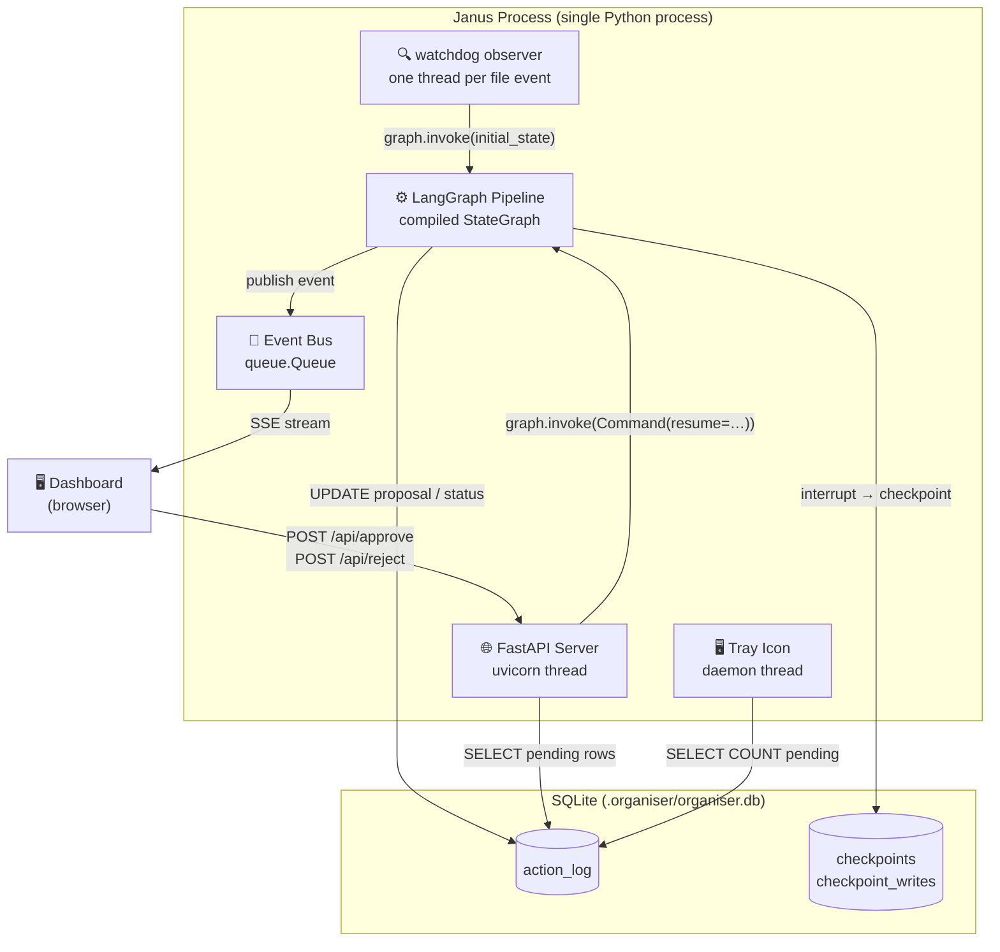
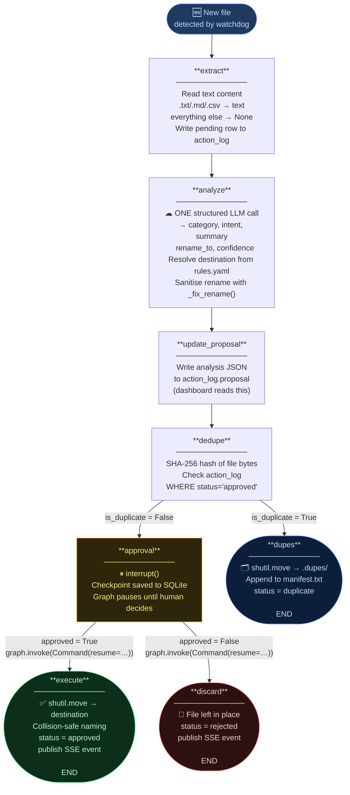
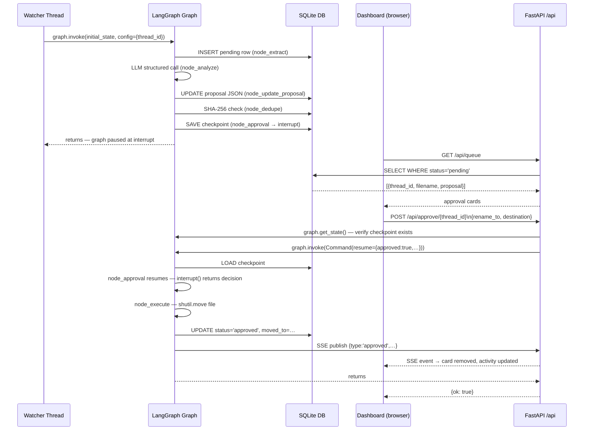
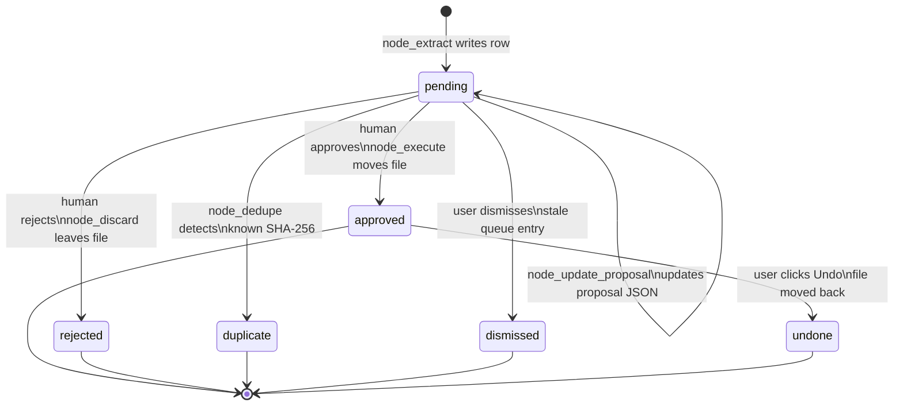
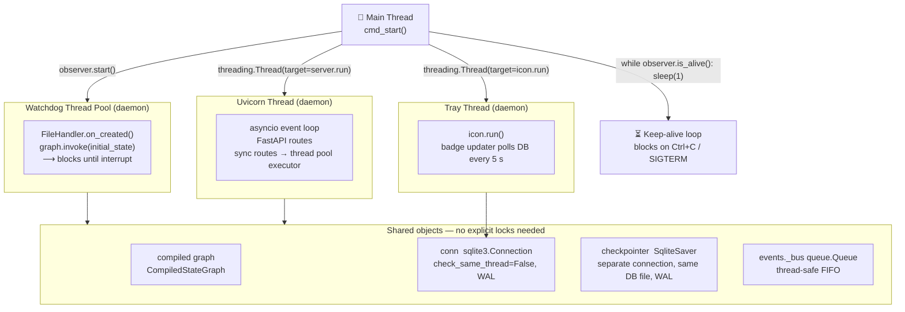

# Janus — Architecture

This document covers the internal design of Janus: the LangGraph pipeline, component responsibilities, database schema, API surface, and the key decisions behind each choice.

---

## System Overview



All three surfaces — watchdog watcher, FastAPI dashboard, and tray icon — share **one compiled graph instance** and **one SQLite connection**. The graph runs per-file; the watcher and server run for the lifetime of the process.

---

## LangGraph Pipeline

### State

Every node reads from and writes to a single `FileState` TypedDict (defined in `src/state.py`). Only the keys a node mutates need to be returned — LangGraph merges the rest.

```
FileState
  path          str          Absolute source path (set by watcher)
  filename      str          Original filename
  thread_id     str          UUID; also the LangGraph thread_id
  content       str | None   Extracted text (txt/md/csv only)
  file_hash     str          SHA-256 of file bytes
  is_duplicate  bool         True if hash matches an approved file
  category      str          Images | Documents | … | Other
  intent        str          invoice | screenshot | report | …
  summary       str          One-line description (empty if no text)
  rename_to     str          Sanitised filename: YYYY-MM_slug.ext
  destination   str          Resolved target folder from rules.yaml
  confidence    float        0.0–1.0 LLM confidence score
  approved      bool | None  None until human decides
  decision_note str | None   Optional human note or rejection reason
```

### Topology



### Checkpointing

The graph is compiled with a `SqliteSaver` checkpointer. At every node boundary, LangGraph writes the full state to the `checkpoints` table. The interrupt at `[approval]` leaves the graph "frozen" — it can be resumed days later, even after a process restart.

**Resume flow:**
```python
# Dashboard API handler (src/api/resume.py)
graph.invoke(
    Command(resume={"approved": True, "rename_to": ..., "destination": ...}),
    config={"configurable": {"thread_id": thread_id}},
)
```

LangGraph loads the checkpoint, feeds `decision` as the return value of `interrupt()`, and continues from `[approval]` → `[execute]` → END.



---

## Components

### `src/watcher.py` — File System Observer

Uses the `watchdog` library. One `FileSystemEventHandler` per watched directory. On each `on_created` event:

1. Skips hidden files (`._*`, `.DS_Store`, etc.) and files already being processed
2. Generates a `uuid4()` as `thread_id`
3. Calls `graph.invoke(initial_state, config={"configurable": {"thread_id": tid}})`

This call **blocks until the interrupt** — the watcher thread is tied up for the duration of extract + analyze + dedupe (typically 2–10 s with a local LLM). If multiple files arrive simultaneously, each gets its own thread (watchdog's default).

### `src/graph.py` — Graph Factory

`make_graph(conn, *, chain, categories, checkpointer, dupes_path, dry_run)` compiles and returns the graph. All nodes are closures over the factory arguments. The graph is compiled once at startup and shared across all file events and API resume calls.

### `src/llm.py` — Provider Factory

`get_llm(provider, model)` returns a LangChain `BaseChatModel`. The switch between Ollama and OpenAI is a single `match` statement — no other file imports a provider directly.

```python
match provider:
    case "ollama": return ChatOllama(model=model)
    case "openai": return ChatOpenAI(model=model)
```

### `src/schema.py` — Structured Output

`AnalysisResult` is a Pydantic model with field validators:

```python
class AnalysisResult(BaseModel):
    category:   str    # validated against CATEGORIES
    intent:     str    # normalised to lowercase slug
    summary:    str    # truncated to 200 chars
    rename_to:  str    # passed through _fix_rename()
    confidence: float  # clamped to 0.0–1.0
```

The chain is `prompt | llm.with_structured_output(AnalysisResult)`. One call, five fields, no retries needed (the model's structured-output mode ensures schema compliance).

### `src/server.py` — FastAPI App

`create_app(conn, graph, rules_path)` builds the FastAPI application and stores shared objects in `app.state`:

```python
app.state.conn       # SQLite action-log connection
app.state.graph      # Compiled LangGraph (shared with watcher)
app.state.rules_path # Path to rules.yaml
```

Uvicorn runs in a **daemon thread** alongside the watchdog observer. Both share the same Python process and the same in-memory objects.

### `src/events.py` — SSE Event Bus

A single `queue.Queue` that nodes push to and the `/api/feed` SSE endpoint polls:

```python
# Nodes call:
publish({"type": "approved", "thread_id": ..., "filename": ..., "moved_to": ...})

# SSE generator polls every 0.4 s:
async def generate():
    while True:
        try:    yield f"data: {json.dumps(bus.get_nowait())}\n\n"
        except: await asyncio.sleep(0.4); yield ": heartbeat\n\n"
```

Thread-safe (Queue is safe for multi-producer, single-consumer). One shared bus for the single-user use case — multiple browser tabs will compete for events.

### `src/tray.py` — System Tray

Runs in a daemon thread. Polls `count_by_status(conn).get("pending", 0)` every 5 s and redraws the icon badge using PIL. Menu is built with pystray and includes a one-click **Open Dashboard** item.

---

## Database Schema

Both the action log and the LangGraph checkpointer live in the same `.organiser/organiser.db` file. They use **separate connections** (the checkpointer manages its own schema).

### `action_log`

```sql
CREATE TABLE action_log (
    id            INTEGER PRIMARY KEY AUTOINCREMENT,
    created_at    TEXT    DEFAULT (strftime('%Y-%m-%dT%H:%M:%SZ', 'now')),
    thread_id     TEXT    NOT NULL,   -- UUID; matches LangGraph thread_id
    filename      TEXT    NOT NULL,   -- original filename
    path          TEXT    NOT NULL,   -- original absolute path
    file_hash     TEXT,               -- SHA-256 (set after dedupe node)
    status        TEXT    NOT NULL,   -- pending|approved|rejected|duplicate|undone|dismissed
    proposal      TEXT,               -- JSON: {category,intent,summary,rename_to,destination,confidence}
    decision_note TEXT,               -- human note or rejection reason
    moved_to      TEXT                -- final destination path (after execute node)
);
```

#### Status lifecycle



### LangGraph checkpointer tables

Managed entirely by `langgraph-checkpoint-sqlite`. Tables: `checkpoints`, `checkpoint_writes`, `checkpoint_migrations`. The checkpointer stores the serialised `FileState` dict at each node boundary, plus metadata about the current interrupt point.

---

## API Reference

All routes are prefixed `/api`. The dashboard SPA (`web/index.html`) is served at `/`.

| Method | Path | Description |
|--------|------|-------------|
| `GET` | `/api/queue` | Pending approval items (status='pending') with parsed proposals |
| `POST` | `/api/approve/{thread_id}` | Resume graph with `approved=True`; optional `rename_to`, `destination` overrides |
| `POST` | `/api/reject/{thread_id}` | Resume graph with `approved=False` |
| `POST` | `/api/dismiss/{thread_id}` | Remove stale pending entry without resuming (sets status='dismissed') |
| `POST` | `/api/undo/{thread_id}` | Move approved file back to original location |
| `GET` | `/api/feed` | Server-Sent Events stream; events: `approved`, `rejected`, `duplicate`, `undone`, `dismissed` |
| `GET` | `/api/stats` | `{pending, moved_today, duplicates, rejections, total}` |
| `GET` | `/api/rules` | Current `rules.yaml` as JSON |
| `POST` | `/api/rules` | Write updated categories to `rules.yaml` |
| `GET` | `/api/activity` | Recent action log rows (default limit 50), newest first |

### Resume request bodies

**POST /api/approve/{thread_id}**
```json
{ "rename_to": "2024-06_aws-invoice.pdf",
  "destination": "~/Documents/Organised/Documents",
  "note": "optional human note" }
```
All fields optional — omitted fields use the AI proposal from the checkpoint.

**POST /api/reject/{thread_id}**
```json
{ "note": "optional rejection reason" }
```

---

## Key Design Decisions

### One structured LLM call per file
All five analysis fields (category, intent, summary, rename, confidence) come from a single `llm.with_structured_output(AnalysisResult)` call. This avoids latency stacking, reduces token cost, and makes the LLM interaction easy to test and mock.

### Destination resolved from category, never from LLM
The LLM chooses a *category*. Janus resolves the destination folder from `rules.yaml` using that category. The LLM is never trusted to produce a valid path — it only picks a label.

### Rename sanitisation in Python, not in the prompt
`_fix_rename()` enforces the `YYYY-MM_slug.ext` convention after the LLM returns. The prompt requests the format as a hint, but Python is the enforcer. This means the rename is always safe even if the model ignores the instruction.

### Rejected files are not marked as duplicates
`hash_exists()` only checks `status='approved'` rows. A rejected file that's resubmitted will be analysed again from scratch rather than silently shelved as a duplicate.

### Single SQLite file, two connections
The action log and LangGraph checkpointer share one `.organiser/organiser.db` file but use separate connections with WAL mode. WAL allows concurrent readers alongside the single writer and prevents lock contention between the watcher thread and the FastAPI thread pool.

### Graph compiled once, shared across threads
The compiled graph is thread-safe for different `thread_id` values. The watcher creates new threads per file event (via watchdog); the FastAPI server handles resume calls in its own thread pool. Both use the same compiled graph instance with WAL-mode SQLite underneath.

### `node_extract` writes the DB row immediately
The `action_log` row is created at the start of the graph run (node_extract) so the dashboard can track in-progress files. The proposal JSON is written later (node_update_proposal, after the LLM runs). The approve/reject API validates that a checkpoint exists before resuming — this guards against race conditions where a file appears in the queue before the graph reaches the interrupt.

---

## Thread Model



---

## Testing

```bash
# Unit tests (no Ollama required)
pytest tests/test_analyze.py -v

# Integration tests (requires: ollama pull qwen3.5)
pytest tests/test_analyze.py -v -m integration
```

The unit tests cover `_slugify`, `_fix_rename`, and the analyze node with a mocked chain. The integration tests send 10 real files through the LLM and assert correct category, intent, rename format, and confidence range.
