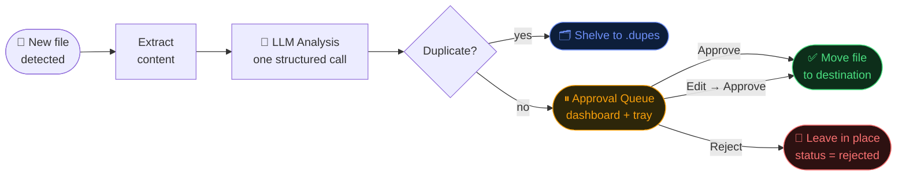

<p align="center">
  
</p>

**AI-powered file organiser with human-in-the-loop approval.**

Janus watches your folders, uses a local LLM to analyse every new file, proposes a rename and destination, then pauses at *the threshold* — waiting for you to approve, edit, or reject before anything moves.

```
janus start          # watch folders + open dashboard
janus start --dry-run  # analyse only, no file moves
janus status         # print action log summary
```

---

## Features

- **Local-first** — default LLM is Ollama (files never leave your machine); swap to OpenAI with one config line
- **Human-in-the-loop** — every file waits for explicit approval before being moved
- **Persistent queue** — LangGraph + SQLite checkpointing means approvals survive process restarts
- **Live dashboard** — FastAPI + SSE web UI at `http://localhost:8000`; approve, edit, reject, undo
- **Duplicate detection** — SHA-256 deduplication shelves known files to `.organiser/.dupes/`
- **System tray** — pending-count badge, one-click dashboard open
- **Provider-agnostic** — switch between Ollama and OpenAI in `rules.yaml`

---

## How It Works



---

## Quick Start

### Prerequisites

| Tool | Version | Purpose |
|------|---------|---------|
| Python | ≥ 3.11 | Runtime |
| [Ollama](https://ollama.com) | latest | Local LLM server |
| `qwen3.5` model | — | Structured-output analysis |

```bash
ollama pull qwen3.5
```

### Install

```bash
git clone https://github.com/SaravananRajaraman/Janus
cd Janus
pip install -e .
```

### Run

```bash
janus start
```

Open **http://localhost:8000** — or right-click the system tray icon → *Open Dashboard*.

Drop a file into `~/Downloads` or `~/Desktop` and it will appear in the approval queue within seconds.

---

## Configuration — `rules.yaml`

```yaml
watch:
  - ~/Downloads
  - ~/Desktop

categories:
  Documents:
    destination: ~/Documents/Organised/Documents
    extensions: [.pdf, .doc, .docx, .odt, .rtf]
  Images:
    destination: ~/Documents/Organised/Images
    extensions: [.jpg, .jpeg, .png, .gif, .webp, .heic]
  # … add as many categories as you like
  Other:
    destination: ~/Documents/Organised/Other
    extensions: []

llm:
  provider: ollama        # or: openai
  model: qwen3.5          # ollama: qwen3.5 | llama3.1  /  openai: gpt-4o-mini

settings:
  dashboard_port: 8000
  db_path: .organiser/organiser.db
  dupes_path: .organiser/.dupes
  dry_run: false
```

To use **OpenAI** instead of Ollama:

```yaml
llm:
  provider: openai
  model: gpt-4o-mini
```

```bash
export OPENAI_API_KEY=sk-...
janus start
```

---

## CLI Reference

| Command | Description |
|---------|-------------|
| `janus start` | Start watcher + dashboard server + tray icon |
| `janus start --dry-run` | Analyse files, write DB rows, no file moves |
| `janus status` | Print action log counts by status |

---

## Dashboard

The web dashboard lives at `http://localhost:8000` and has three tabs:

**Queue** — one card per pending file showing the AI proposal (rename, destination, category, confidence). Actions:
- **Approve** — move the file as proposed
- **Edit** — override the rename or destination before approving
- **Reject** — leave the file in place, mark as rejected

**Activity** — live feed of completed actions (SSE-powered). Each approved row has an **Undo** button that moves the file back.

**Rules** — edit category destinations in-browser; changes are written back to `rules.yaml`.

---

## Auto-Start (Windows)

Import `scripts/task.xml` into Windows Task Scheduler to launch Janus at login:

```powershell
schtasks /create /xml scripts\task.xml /tn "Janus Organiser"
```

Edit the `<Command>` and `<WorkingDirectory>` paths in the XML to match your Python environment first.

---

## Project Layout

```
Janus/
├── src/
│   ├── main.py           # CLI entry point
│   ├── state.py          # FileState TypedDict (graph spine)
│   ├── graph.py          # LangGraph StateGraph topology
│   ├── watcher.py        # watchdog file-system observer
│   ├── db.py             # SQLite action log
│   ├── checkpoint.py     # LangGraph SqliteSaver factory
│   ├── server.py         # FastAPI app factory
│   ├── tray.py           # pystray system tray icon
│   ├── events.py         # Thread-safe SSE event bus
│   ├── llm.py            # LLM provider factory (Ollama / OpenAI)
│   ├── prompts.py        # ChatPromptTemplate + structured-output chain
│   ├── schema.py         # AnalysisResult Pydantic model
│   ├── extract.py        # Text extraction for .txt/.md/.csv
│   ├── routing.py        # LangGraph conditional edge functions
│   ├── nodes/
│   │   ├── analyze.py    # LLM analysis node
│   │   ├── approval.py   # Human-in-the-loop interrupt node
│   │   ├── dedupe.py     # SHA-256 duplicate detection node
│   │   ├── execute.py    # File move node
│   │   ├── dupes.py      # Duplicate shelving node
│   │   └── discard.py    # Rejection node
│   └── api/
│       ├── queue.py      # GET  /api/queue
│       ├── resume.py     # POST /api/approve|reject|undo|dismiss
│       ├── feed.py       # GET  /api/feed  (SSE)
│       ├── stats.py      # GET  /api/stats
│       └── rules.py      # GET/POST /api/rules
├── web/
│   └── index.html        # Single-file SPA dashboard
├── tests/
│   └── test_analyze.py   # Unit + integration tests for the analyze node
├── scripts/
│   └── task.xml          # Windows Task Scheduler auto-start
├── rules.yaml            # User configuration
└── pyproject.toml        # Package metadata + dependencies
```

See [ARCHITECTURE.md](ARCHITECTURE.md) for the full technical design.

---

## Tech Stack

| Layer | Technology |
|-------|-----------|
| Orchestration | [LangGraph](https://github.com/langchain-ai/langgraph) `StateGraph` |
| LLM (local) | [Ollama](https://ollama.com) via `langchain-ollama` |
| LLM (cloud) | OpenAI via `langchain-openai` |
| File watching | [watchdog](https://github.com/gorakhargosh/watchdog) |
| Persistence | SQLite (WAL mode) — action log + LangGraph checkpointer |
| API server | [FastAPI](https://fastapi.tiangolo.com) + uvicorn |
| Live feed | Server-Sent Events (SSE) |
| Dashboard | Vanilla HTML/CSS/JS (no build tool) |
| System tray | [pystray](https://github.com/moses-palmer/pystray) + Pillow |

---

## License

MIT — see [LICENSE](LICENSE).
